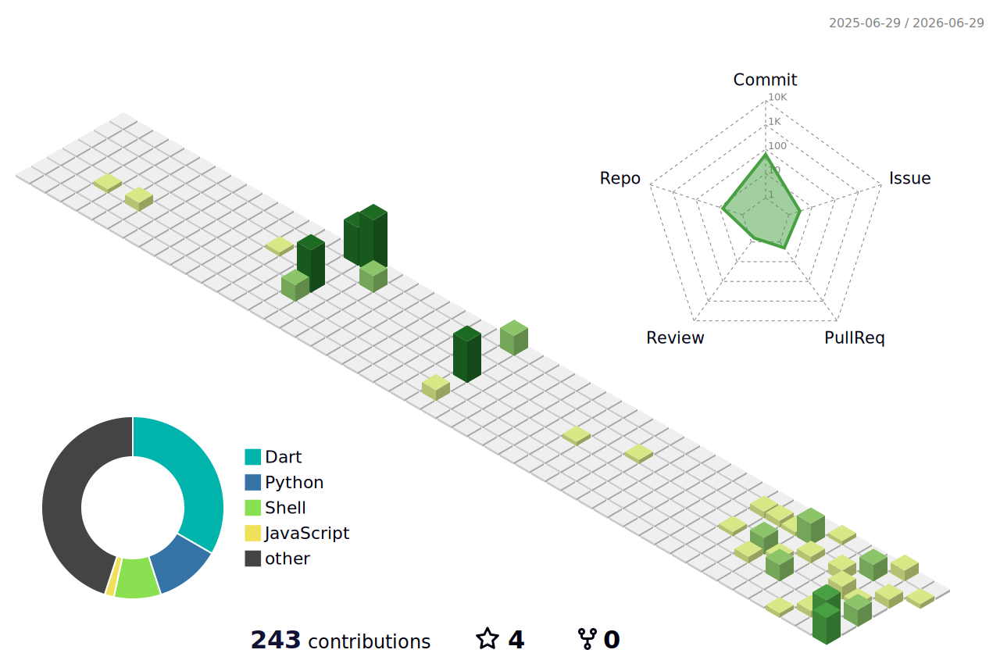

<h1 align="left">Hi there 👋, I'm Yassine Ben Moussa</h1>
<h3 align="left">Computer Science & Multimedia Student | Developer | Tech Enthusiast</h3>

  

### 👨‍💻 About Me

Hello! I'm **Yassine Ben Moussa**, Computer Science and Multimedia Bachelor’s student with a strong interest in Artificial Intelligence and software development. Certified in AI and Python, with hands-on experience in programming, problem solving, and technical support. Actively seeking an internship or junior role where I can apply AI and programming skills in real-world projects..

---

### 📜 Certifications

<!-- CREDLY_BADGES_START -->

<!-- CREDLY_BADGES_END -->

---

### 🛠️ Languages & Tools

  
  
  
  
  
  

---

### 📫 Connect with Me

  
  
  
  

---

### 📊 GitHub Stats

